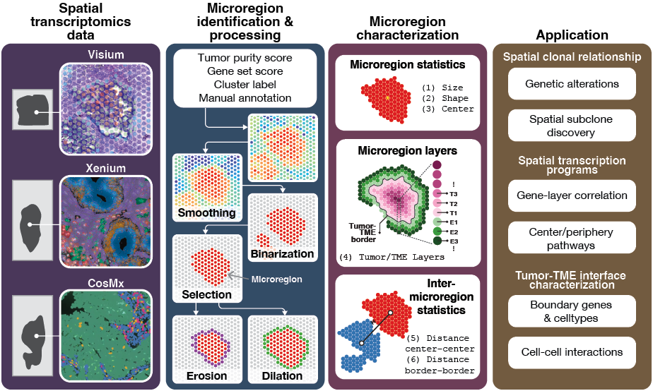

# morph



Accurately defining spatial characteristics of tumors has been a challenge in cancer research. Specifically, there is still a lack of spatial transcriptomic (ST) bioinformatic methods that infer tumor boundaries, a necessity for tumor microenvironment (TME) analyses, that are fully automated and handle non-rectangular grids (like the one found in Visium). Here we introduce Morph, a toolset that not only addresses these limitations, but also accurately extracts tumor regions, layers surrounding them, and distances related to such regions. Morph was tested on a dataset composed of 117 ST slides across 6 different cancer types, including primary and metastatic tumors. More broadly, Morph is a computationally efficient tool based on mathematical morphology that is designed to work without any approximations on ST slides (that can be composed of spots in a hexagonal lattice) of any resolution. The toolset accepts a variety of input types, such as tumor purity and manual annotation, and can perform a diverse set of morphological operations, such as erosion, dilation, opening and closing, using a number of structuring elements with different shapes and sizes, such as a hexagon of side 1. Moreover, Morph runs quickly (seconds per sample). Its main focus is to unveil the aforementioned features of any spatially distinct tumor region (here defined as microregion) for various downstream analyses, such as spatially-varying copy number variations, cell-type distribution, and tumor-microenvironment interaction. Overall, we developed a spatial transcriptomics toolset that is not limited to any specific technology platform, and that can accurately extract ST features facilitating the discovery of spatial transcriptomic and interaction patterns.

To install morph, simply run:

```
pip install git+https://git@github.com/ding-lab/morph.git
```

The following code snippet shows how to run Morph for Fig. 5:

```
import Morph, numpy

# Parameters
d = 10
G = {'TFF2', 'KRT7'}
S = numpy.ones((3, 3))
tau = 3
lambda_ = 4

# Loading
data = Morph.readers.transcripts('path/to/transcripts.csv.gz')

# Running
image = Morph.backbone(data, ['xenium', d], ['total', G], ['maximum'], ['closing', S], ['binary', tau], ['area_opening', lambda_], ['blob', S])

cells = Morph.readers.cells('path/to/cells.csv.gz')
mapper = Morph.modules.Mapper()
cells = mapper.xenium(cells, d)

# Saving
Morph.writers.xenium('path/to/csv', image, cells)
```

## Contact
Andre Targino at andretargino@wustl.edu
